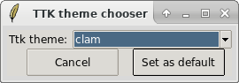

TTK Theme chooser
===

TK 8.5 added a fabulous new feature (and set of procs) called TTK which give a modern look to tk widgets. But they forget to give an easy way to change the default theme ! So most people doesn't even know they can change how TCL/TK or Python/TKinter applications look.

Here it is, TTK theme chooser is just a little window to choose and set the default TTK theme on linux.

## Installation

    ./configure
    make
    make install
(sudo make install if you're not root)

Installation is optionnal, you can simply do `tclsh ttk-theme-chooser.tcl` too.

## Usage

Just type `ttk-theme-chooser` in terminal or find `TTK Theme chooser` in your desktop applications menu.

